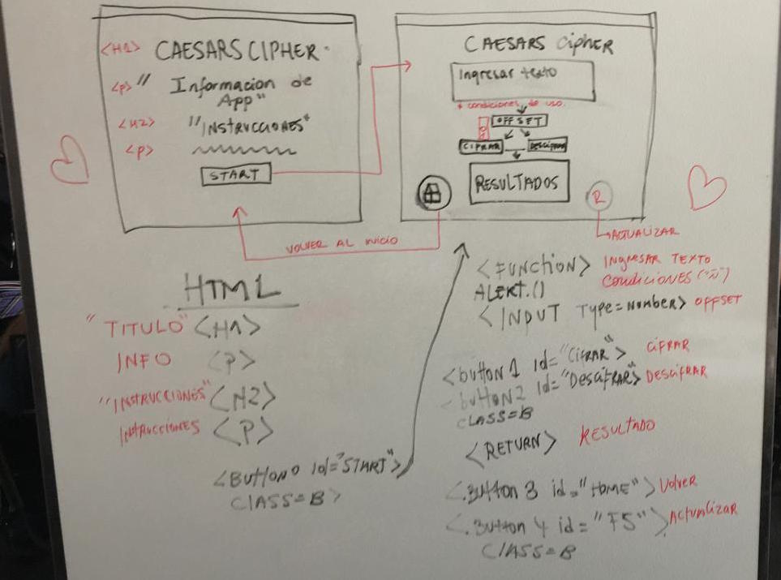
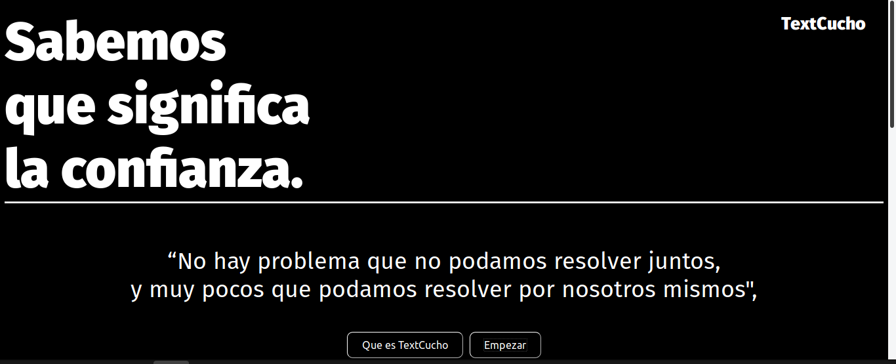
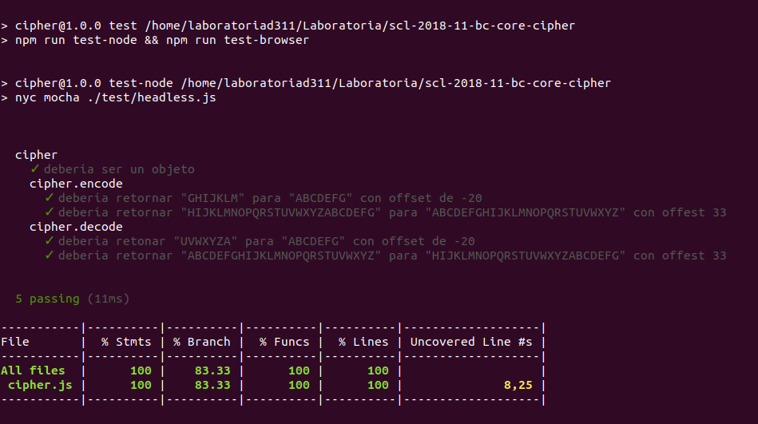

**Textcucho App.**

Plataforma que recibe quejas y sugerencias de parte de los funcionarios de diferentes empresas para mejorar el ambiente laboral.

**USUARIO**
¿Quien es el usuario? 
Funcionarixs de diferentes empresas que trabajan con nosotrxs y quieren dar su opinion o testimonio respecto del ambiente aboral en el que se desempeñan y/o sobre lxs compañerxs con lxs que comparten. Mas no sienten la confianza para poder comunicarlo de manera abierta y directa.

**¿Cual es el objetivo de la aplicacion?**
Obtener y cifrar los mensajes del usuarix brindandole la privacidad y seguridad que se merece sin miedo a represalias al tratar el asunto con los involucradxs.

**¿Cual es la necesidad del usuario?**
Tener espacios seguros para comunicar de forma anonima su sentir respecto de lo que pasa en su entorno laboral.

**¿Como el producto satisface la necesidad del usuarix?**
Textcucho encripta el mensaje a traves de un sistema de cifrado de ultima generacion, garantizando que los datos confiados por el usuario solo son accesibles para nuestro equipo, el cual hara todas gestiones para solucionar el problema que lo aqueja.

**¿Como interactua el usuario con el producto?**
En la interfaz principal se aprecia debajo del texto de bienvenida el boton "QUE ES TXTCUCHO", que despliega un texto explicativo, y otro boton de "EMPEZAR" que lleva a las Instrucciones y a la ventana de Ingreso del  mensaje, luego debe seleccionar las posiciones de desplazamiento de los caracteres; bajando se encuentran los botones de "CIFRAR" o "DESCIFRAR", al elegir uno aparece el resultado, y finalmente un boton de enviar y otro de volver al inicio.

**Historia de Usuario**

Daniela R. tiene 26 años, trabaja en Empresa X hace 2 años, excelente funcionaria, destaca siempre por su buena disposicion a aprender y por su compromiso con el trabajo. En el local donde esta llego un jefe nuevo que es muy carismatico y de trato cercano, quizas mucho para lo que ella considera apropiado y se siente incomoda cada vez que tiene que compartir con él, pero se siente demasiado cohibida para decirle su parecer por miedo.
Daniela ingresa a TxtCuchamos donde cuenta su historia con la conviccion de que nadie tendra acceso mas que el equipo que la ayudara a solucionar su problema.

**PROCESO DE DISEÑO**

**Como empezo**

Al principio se penso en hacer dos interfaces que estuvieran conectadas y repartir los cometidos, una Interfaz de bienvenida con Instrucciones, y otra con la ventana para ingresar texto, elegir el desplazamiento, opcion cifrar o descifrar, texto con el resultado y un boton de volver al inicio.

**Como quedo**

Con el paso del tiempo esta idea fue mutando y consideranmos que no nos convenia hacer un sitio tan complicado, si no todo lo contrario, queremos darle una experiencia simple, pero a la vez tranquila y donde se sintiera segurx de donde estaba dejando su testimonio. Por eso se dejo todo en una sola interfaz donde se diera la opcion de desplegar el contenido segun lo que estuviera buscando el usuario. En el inicio, por ejemplo, puede decidir entre leer informacion sobre el metodo de cifrado o pasar directamente a las instrucciones y cifrar su texto.

**Caracteristicas**

Los colores que se ocuparon fueron seleccionados por la seriedad, prudencia y elegancia que entregan visualmente.
La tipografia que se eligio fue "Fira Sans" ya que se considera que las fuentes del tipo "sans" transmiten modernidad, seguridad y en ciertas ocasiones neutralidad o minimalismo.
Las imagenes que hay estan con el fin de facililtar la comprension del metodo de cifrado al usuario.
Se crearon pocos botones para mantener el estilo minimalista y hacerlo lo mas facil de usar.

**Como se usa**

En la interfaz se encuentra una cita y debajo dos botones, uno contiene informacion sobre TextCucho y como funciona, y el otro boton despliega la ventana para ingresar el texto, inmediatamente abajo de eso estan los botones de "Cifrar" o "descifrar" que al presionar cualquiera de los dos muestra el resultado y la opcion de enviar o volver a empezar. 

**Descarga**

Por el momoento TextCucho no cuenta con enlace de descarga.

**¿Realmente funciona?**

Si, lo comprobamos al ejecutar "npm test" con Mocha y Chai en la terminal, aqui una imagen del resultado.

